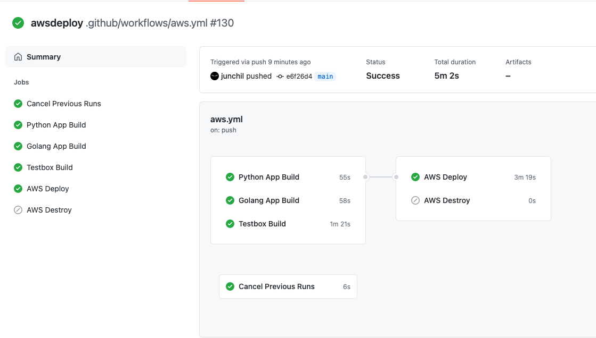

## CICD

The whole CICD process is controlled by the github action.



Steps:
```
1. Build web application docker image and push it to AWS ECR.

2. Provision terraform aws resources.

3. Deploy application helm charts to eks cluster
```

1. Every new merge to master will automatically trigger new deployment.

2. Every new release will automatically trigger new deployment. 

3. Also you can deploy a specific branch by using custom commit message "deploy-to-aws" in travis to trigger a deployment. 

4. For destroying all the aws resources, you can use custom commit message "destroy-to-aws" in travis.