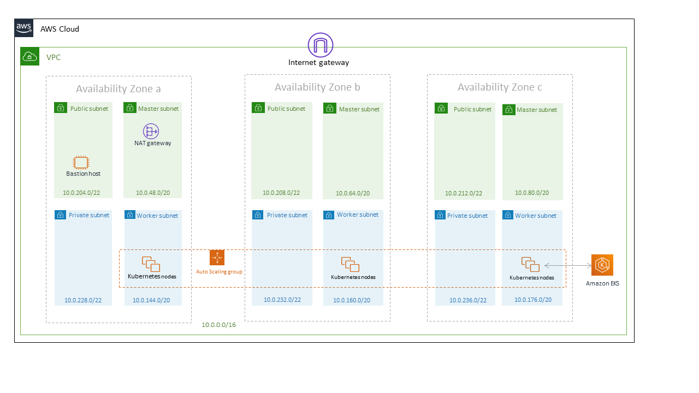
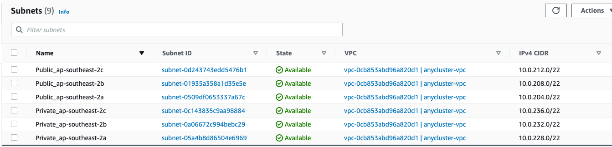
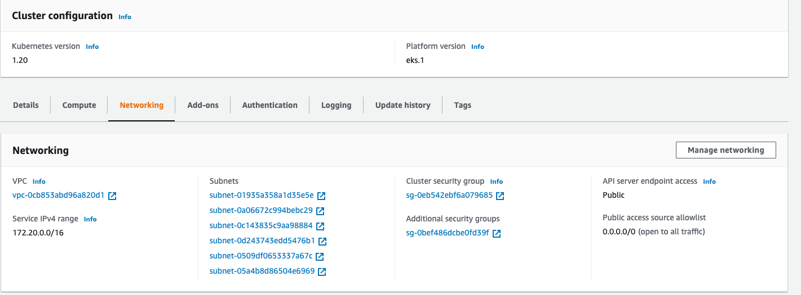
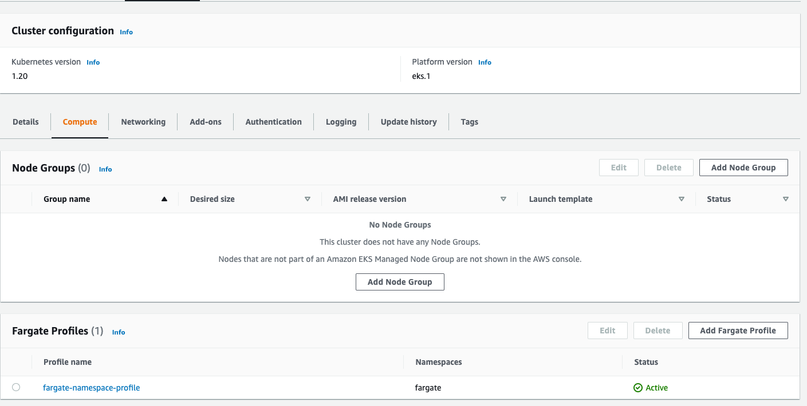
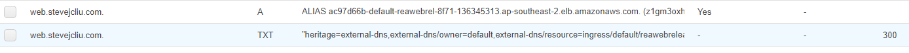
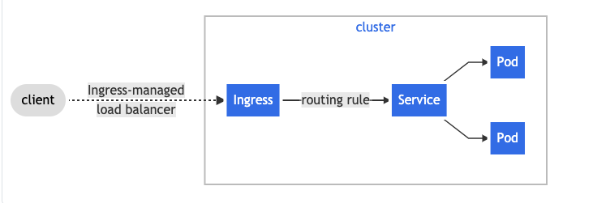

# eks-cluster
[](https://github.com/junchil/eks-cluster/actions/workflows/aws.yml)

Cluster external endpoints:
* https://web.stevejcliu.com/python
* https://web.stevejcliu.com/golang

Overview:
- Host web application inside aws eks cluster using alb + nginx ingress.
- CICD using github action
- Terraform for provision aws resources
- Helm charts for managing eks cluster

Table of Contents                                                                                                                       
============================================
* [Directory Structure](DIRECTORY.md)
* [Set up](SETUP.md)
* [CICD](CICD.md)
* [AWS](#aws)
* [Helm Charts](#helm-charts)
* [Reference](#reference)
* [To Do](TODO.md)

## AWS


VPC:
* In the vpc module, it create two subnets: public subnets, private subnets.
* Public subnets are public to internet. They are connected to [Internet gateway](https://docs.aws.amazon.com/vpc/latest/userguide/VPC_Internet_Gateway.html).
* Private subnets are private. They are connected to [NAT gateway](https://docs.aws.amazon.com/vpc/latest/userguide/vpc-nat-gateway.html) for getting internet traffic.
* Bastion host sits in the public subnets.
* Amazon [EKS](https://aws.amazon.com/eks/) is using both public subnets and private subnets.
* Kubernetes worker nodes sit in private subnets.
* For saving money, the terraform doesn't provide ASG for bastion host, and nat gateway in each AZs.



Cluster:
* Kubernetes worker nodes are using self mangaed worker nodes, [Auto Scaling Group](https://docs.aws.amazon.com/autoscaling/ec2/userguide/AutoScalingGroup.html). It also supports [Spot Instance](https://docs.aws.amazon.com/AWSEC2/latest/UserGuide/using-spot-instances.html).
* Also enable fargate


Bastion host:
* [Bastion host](https://docs.aws.amazon.com/quickstart/latest/linux-bastion/architecture.html) is a single vm which sits in the public subnets. It is used for managing the kubernetes work nodes if there is a need.
* SSH port 22 is enabled in bastion host vm.

## Helm charts

- Kubernetes ingress resources by provisioning Application Load Balancers with [aws-alb-ingress-controller](https://github.com/helm/charts/tree/master/incubator/aws-alb-ingress-controller)
- Auto DNS entry with [external-dns](https://github.com/helm/charts/tree/master/stable/external-dns). The following two records are automatically generated by it.


- Ingress controller that uses ConfigMap to store the nginx configuration. [nginx-ingress](https://github.com/helm/charts/tree/master/stable/nginx-ingress)
- SSL Enable
- Hostname -> routing rules
- Can support multiple ingress class

```
kubectl get po
NAME                                             READY   STATUS      RESTARTS   AGE
pi-dgbmv                                         0/1     Completed   0          4m28s
servian-albcontroller-67ddc8fbb6-wvx9t           1/1     Running     0          4m28s
servian-externaldns-6bcf4d755b-mm62w             1/1     Running     0          4m28s
servian-nginx-controller-8c7cbc6fd-z67r7         1/1     Running     0          4m28s
servian-nginx-default-backend-85ffc485d8-bk9r4   1/1     Running     0          4m28s
servian-postgresql-0                             1/1     Running     0          4m28s
servian-reaweb-d77f64f89-ttvwq                   1/1     Running     0          4m18s
servian-testbox-5dc9c48d7d-bjsfv                 1/1     Running     0          4m28s
```
```
kubectl get deploy
NAME                            READY   UP-TO-DATE   AVAILABLE   AGE
servian-albcontroller           1/1     1            1           5m57s
servian-externaldns             1/1     1            1           5m57s
servian-nginx-controller        1/1     1            1           5m57s
servian-nginx-default-backend   1/1     1            1           5m57s
servian-reaweb                  1/1     1            1           5m57s
servian-testbox                 1/1     1            1           5m57s
```
```
kubectl get svc
NAME                            TYPE        CLUSTER-IP       EXTERNAL-IP   PORT(S)                      AGE
kubernetes                      ClusterIP   172.20.0.1       <none>        443/TCP                      9m35s
servian-externaldns             ClusterIP   172.20.75.5      <none>        7979/TCP                     6m17s
servian-nginx-controller        NodePort    172.20.193.215   <none>        80:32079/TCP,443:30338/TCP   6m16s
servian-nginx-default-backend   ClusterIP   172.20.125.90    <none>        80/TCP                       6m16s
servian-postgresql              ClusterIP   172.20.117.121   <none>        5432/TCP                     6m16s
servian-postgresql-headless     ClusterIP   None             <none>        5432/TCP                     6m17s
servian-reaweb                  NodePort    172.20.126.35    <none>        3000:30055/TCP               6m16s
```
```
kubectl get ingress
NAME                  HOSTS   ADDRESS                                                                       PORTS   AGE
servian-elb-ingress   *       ac97d66b-default-servianel-92e9-1878420424.ap-southeast-2.elb.amazonaws.com   80      6m34s
servian-reaweb        *       10.0.157.95   
```
```
kubectl get nodes
NAME                                             STATUS   ROLES    AGE    VERSION
ip-10-0-157-95.ap-southeast-2.compute.internal   Ready    <none>   7m8s   v1.16.8-eks-e16311
ip-10-0-161-51.ap-southeast-2.compute.internal   Ready    <none>   7m5s   v1.16.8-eks-e16311
ip-10-0-187-81.ap-southeast-2.compute.internal   Ready    <none>   7m3s   v1.16.8-eks-e16311
```
This job is used for init postgresql.
```
sliu@MLB-LT-300175:/mnt/d/go/src/github.com/junchil/go-db-kubernetes/ignore$ kubectl get job
NAME   COMPLETIONS   DURATION   AGE
pi     1/1           62s        7m11s
```