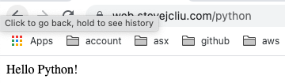
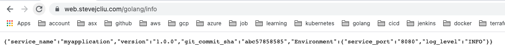
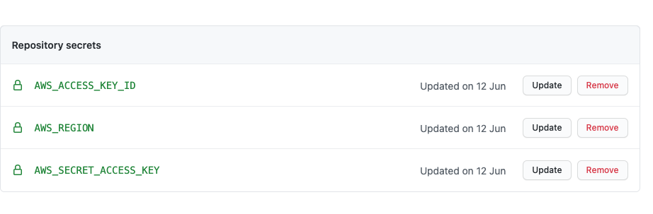
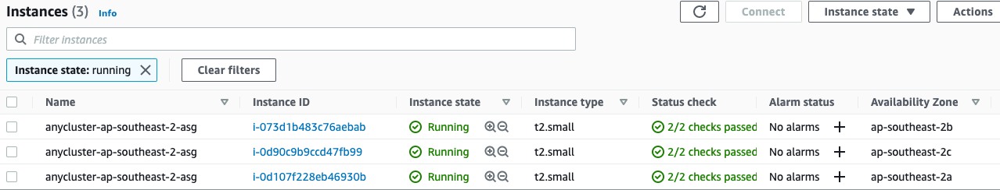
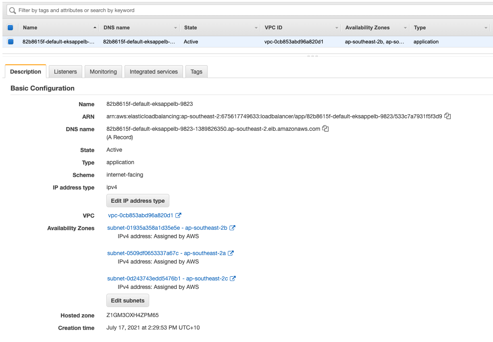
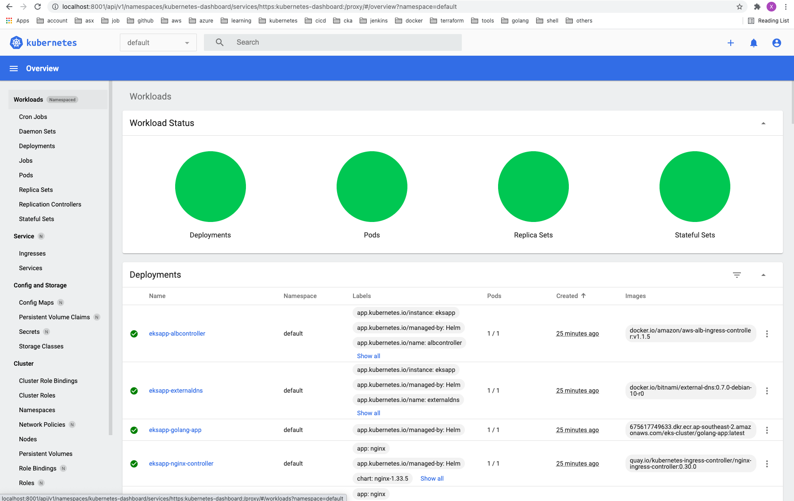

# eks-cluster
[](https://github.com/junchil/eks-cluster/actions/workflows/aws.yml)

Cluster external endpoints:
* https://web.stevejcliu.com/python



* https://web.stevejcliu.com/golang


* https://web.stevejcliu.com/golang/info



The CICD pipeline can be found here: https://github.com/junchil/eks-cluster/actions

Github secrets



Overview:
- Host web application inside aws eks cluster using alb + nginx ingress.
- CICD using github action
- Terraform for provision aws resources
- Helm charts for managing eks cluster

Table of Contents                                                                                                                       
============================================
* [Directory Structure](DIRECTORY.md)
* [Set up](SETUP.md)
* [CICD](CICD.md)
* [AWS](#aws)
* [Helm Charts](#helm-charts)
* [To Do](TODO.md)
* [Reference](REF.md)

## AWS
**Overview**:


**VPC**:
* In the vpc module, it create two subnets: public subnets, private subnets.
* Public subnets are public to internet. They are connected to [Internet gateway](https://docs.aws.amazon.com/vpc/latest/userguide/VPC_Internet_Gateway.html).
* Private subnets are private. They are connected to [NAT gateway](https://docs.aws.amazon.com/vpc/latest/userguide/vpc-nat-gateway.html) for getting internet traffic.
* Bastion host sits in the public subnets.
* Amazon [EKS](https://aws.amazon.com/eks/) is using both public subnets and private subnets.
* Kubernetes worker nodes sit in private subnets.
* For saving money, the terraform doesn't provide ASG for bastion host, and nat gateway in each AZs.


**EKS Cluster**:
* Kubernetes worker nodes are using self mangaed worker nodes, [Auto Scaling Group](https://docs.aws.amazon.com/autoscaling/ec2/userguide/AutoScalingGroup.html). It also supports [Spot Instance](https://docs.aws.amazon.com/AWSEC2/latest/UserGuide/using-spot-instances.html).
* Also enable fargate



**ALB**:


**Bastion host**:
* [Bastion host](https://docs.aws.amazon.com/quickstart/latest/linux-bastion/architecture.html) is a single vm which sits in the public subnets. It is used for managing the kubernetes work nodes if there is a need.
* SSH port 22 is enabled in bastion host vm.

## Helm charts

- Kubernetes ingress resources by provisioning Application Load Balancers with [aws-alb-ingress-controller](https://github.com/helm/charts/tree/master/incubator/aws-alb-ingress-controller)
- Auto DNS entry with [external-dns](https://github.com/helm/charts/tree/master/stable/external-dns). The following two records are automatically generated by it.

- Ingress controller that uses ConfigMap to store the nginx configuration. [nginx-ingress](https://github.com/helm/charts/tree/master/stable/nginx-ingress)
- SSL Enable
- Hostname -> routing rules
- Can support multiple ingress class

```
 ~/g/s/gi/j/eks-cluster/i/t/eks | main !2 ?1  kubectl get po             INT | 33m 48s | aws kube | 15:19:05 
NAME                                            READY   STATUS    RESTARTS   AGE
eksapp-albcontroller-74bb58b9fc-2blj9           1/1     Running   0          49m
eksapp-externaldns-595b9688fc-wwk9r             1/1     Running   0          49m
eksapp-golang-app-bfd857976-kwvr4               1/1     Running   0          59m
eksapp-nginx-controller-7c88f9d586-qj6hg        1/1     Running   0          59m
eksapp-nginx-default-backend-566b98cbf8-d2ndp   1/1     Running   0          59m
eksapp-postgresql-0                             1/1     Running   0          59m
eksapp-python-app-5d55d98fbb-6wfc5              1/1     Running   0          59m
eksapp-testbox-c8cbff867-rrzw5                  1/1     Running   0          59m
```
```
 ~/g/s/gi/j/eks-cluster/i/t/eks | main !2 ?1  kubectl get deploy               ok | 3s | aws kube | 15:19:12 
NAME                           READY   UP-TO-DATE   AVAILABLE   AGE
eksapp-albcontroller           1/1     1            1           59m
eksapp-externaldns             1/1     1            1           59m
eksapp-golang-app              1/1     1            1           59m
eksapp-nginx-controller        1/1     1            1           59m
eksapp-nginx-default-backend   1/1     1            1           59m
eksapp-python-app              1/1     1            1           59m
eksapp-testbox                 1/1     1            1           59m
```
```
 ~/g/s/gi/j/eks-cluster/i/t/eks | main !2 ?1  kubectl get svc                       ok | aws kube | 15:19:32 
NAME                           TYPE        CLUSTER-IP       EXTERNAL-IP   PORT(S)                      AGE
eksapp-externaldns             ClusterIP   172.20.29.85     <none>        7979/TCP                     59m
eksapp-golang-app              NodePort    172.20.164.156   <none>        3000:32243/TCP               59m
eksapp-nginx-controller        NodePort    172.20.181.188   <none>        80:32044/TCP,443:31277/TCP   59m
eksapp-nginx-default-backend   ClusterIP   172.20.189.204   <none>        80/TCP                       59m
eksapp-postgresql              ClusterIP   172.20.184.216   <none>        5432/TCP                     59m
eksapp-postgresql-headless     ClusterIP   None             <none>        5432/TCP                     59m
eksapp-python-app              NodePort    172.20.72.232    <none>        5000:31646/TCP               59m
kubernetes                     ClusterIP   172.20.0.1       <none>        443/TCP                      64m
```
```
 ~/g/s/gi/j/eks-cluster/i/t/eks | main !2 ?1  kubectl get ingress                   ok | aws kube | 15:19:48 
NAME                 CLASS    HOSTS   ADDRESS                                                                       PORTS   AGE
eksapp-elb-ingress   <none>   *       82b8615f-default-eksappelb-9823-1389826350.ap-southeast-2.elb.amazonaws.com   80      60m
eksapp-golang-app    <none>   *       10.0.228.159                                                                  80      60m
eksapp-python-app    <none>   *       10.0.228.159                                                                  80      60m
```
```
 ~/go/src/github.com/junchil/eks-cluster/infra/terraform/eks | main !2 ?1  kubectl get nodes                                                               ok | aws kube | 15:20:07 
NAME                                              STATUS   ROLES    AGE   VERSION
ip-10-0-228-159.ap-southeast-2.compute.internal   Ready    <none>   61m   v1.20.4-eks-6b7464
ip-10-0-232-67.ap-southeast-2.compute.internal    Ready    <none>   61m   v1.20.4-eks-6b7464
ip-10-0-238-13.ap-southeast-2.compute.internal    Ready    <none>   61m   v1.20.4-eks-6b7464
```
```
 ~/g/s/gi/j/eks-cluster/infra/terraform/eks | main !2 ?1  kubectl get storageclass                                                                         ok | aws kube | 15:20:58 
NAME            PROVISIONER             RECLAIMPOLICY   VOLUMEBINDINGMODE      ALLOWVOLUMEEXPANSION   AGE
gp2 (default)   kubernetes.io/aws-ebs   Delete          WaitForFirstConsumer   false                  65m
```
